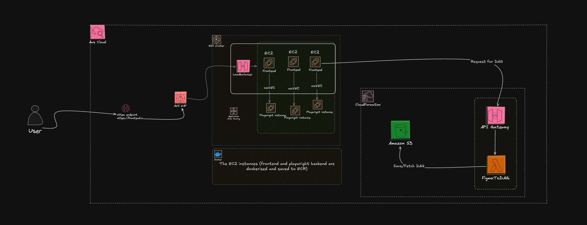

# Figma Automation

This is a project that automates the process of creating a DAG from a Figma file and then executing the DAG to take screenshots of the nodes in the browser using figma prototype.


## Table of Contents

- [Architecture](#architecture)
- [Prerequisites](#prerequisites)
- [Installation](#installation)
- [Project Structure](#project-structure)
- [Data Flow](#data-flow)

## Architecture



### AWS WAF
- **Purpose**: Provides a security layer for the application.
- **Capabilities**: Mitigates authorization issues, DDOS, and several basic attacks.

### API Layer
- **API Gateway**: Handles requests and routes them to AWS Lambda.
- **Lambda (FigmaToDAG)**: Generates a Directed Acyclic Graph (DAG) based on Figma credentials.

### Compute Layer
- **EKS Cluster**: Hosts the Next.js application for the frontend.
- **Frontend Instance**: A web application with a form to collect credentials from users and forward them to a Playwright instance or Lambda function.
- **Playwright Instance**: Automates interactions based on the DAG and serves the instance through a noVNC server.
  - *Note*: The Frontend and Playwright instances are dockerized.

### Storage Layer
- **S3**: An S3 bucket used to store DAGs based on versions.

## Prerequisites

- [Info to Lambda Function installation and usage](https://github.com/Marcus0086/figmaToDAG/blob/main/Readme.md)
- Docker
- Node.js
- npm

## Installation

1. Clone the repository 
```bash
git clone https://github.com/Marcus0086/figmatoDAG_automation.git
```
2. Use lambda function guide to install and use the lambda function.
3. Create `.env` file and add the following variables:
```bash
BROWSER_VNC_URL=http://127.0.0.1:6080
LAMBDA_FUNCTION_URL=https://abcd.execute-api.us-east-1.amazonaws.com/Prod/ # Replace with your lambda function url
```
4. Run docker compose
```bash
docker compose up --build -d
```
5. Open the app in your browser at `http://localhost:3000`

## Project Structure

```bash
├── next-env.d.ts
├── next.config.ts
├── package.json
├── public
│   ├── images
├── src
│   ├── app
│   │   ├── layout.tsx
│   │   ├── page.tsx
│   ├── components
│   │   └── ui
│   ├── hooks
│   └── lib
│       ├── actions
└── tsconfig.json
```

## Data Flow


### Initial Request Flow
1. User accesses the frontend application through their browser
2. The web application presents a form requesting Figma credentials
3. User submits credentials through server actions (Next.js)

### DAG Generation Process
1. Frontend server actions initiate a Playwright instance
2. Playwright authenticates and opens the Figma prototype in a browser window
3. The file ID is extracted and sent to the Lambda function via API Gateway
4. Lambda function processes the request and generates a DAG
5. Generated DAG is:
   - Stored in S3 bucket (versioned with fileID)
   - Returned to the frontend application

### Automation Flow
1. The Playwright instance runs on-premise and is accessible through:
   - noVNC server
   - Embedded iframe in the frontend
2. Server actions control the Playwright instance to:
   - Navigate through prototype states
   - Execute interactions (click, scroll, hover)
   - Capture screenshots
3. Real-time interaction feedback is visible through the noVNC iframe
4. Screenshots are automatically captured and stored after each state change


## TODO